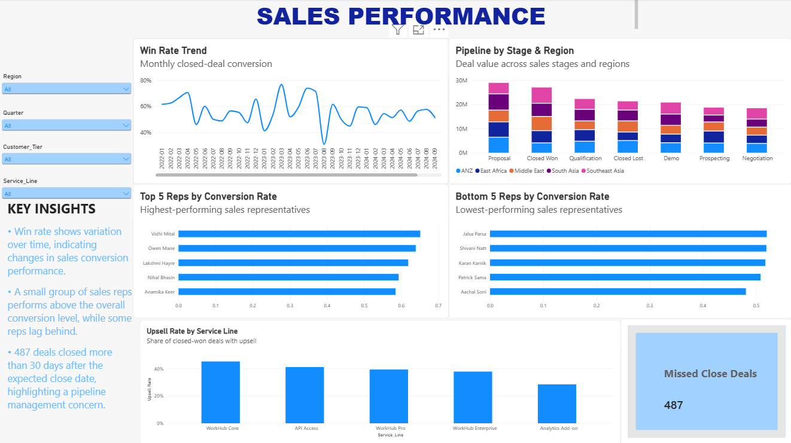
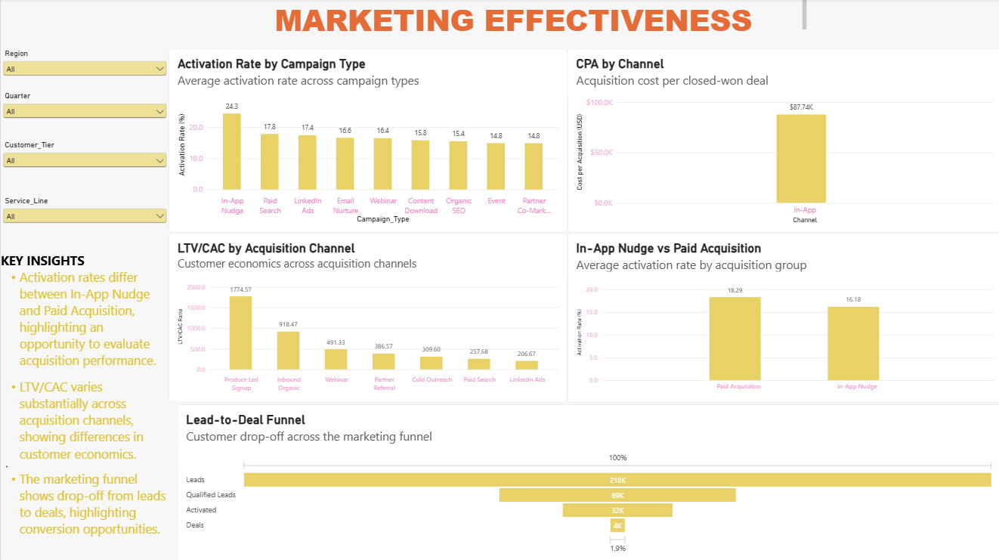
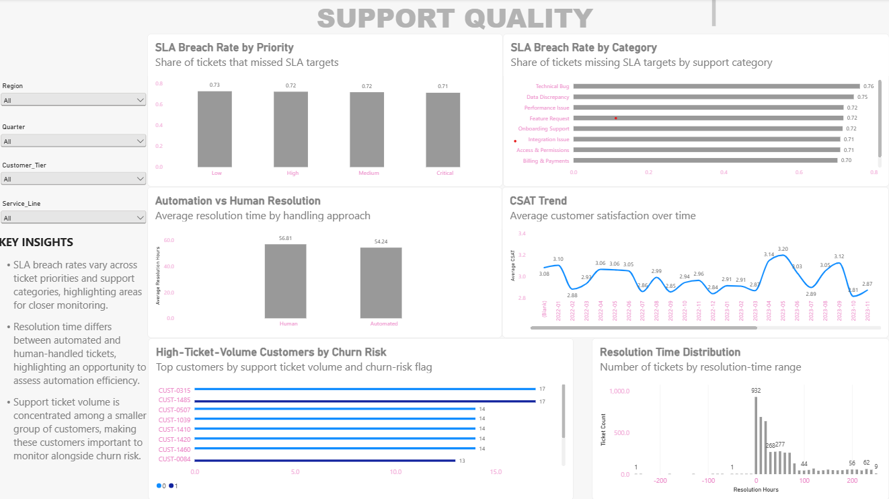
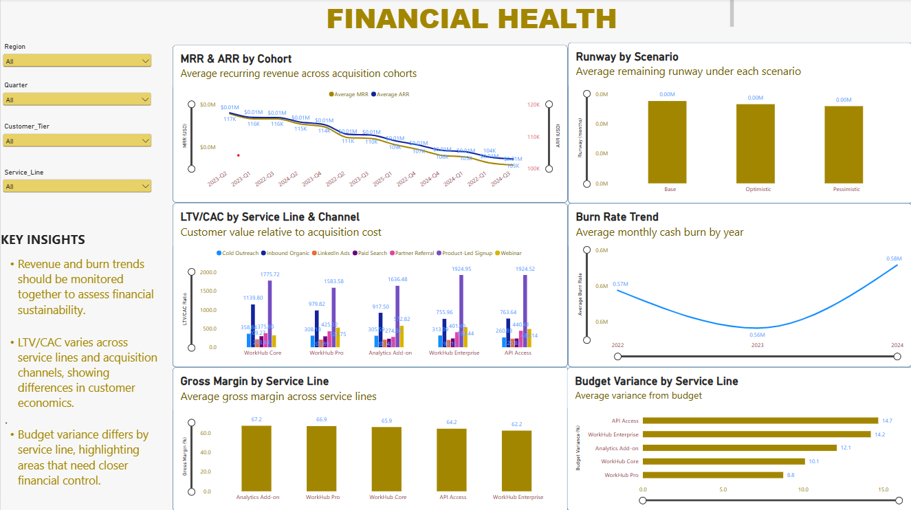
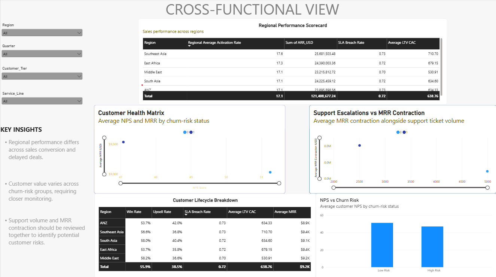

# GenP Business Analytics Capstone Project

## Overview

An end-to-end Business Analytics capstone project focused on analyzing growth-related challenges across sales, marketing, customer support, and financial performance.

The project follows a Business Analyst workflow:

**Business Problem → KPI Framework → Data Analysis → Statistical Analysis → Dashboard → Business Recommendations**

## Business Problem

The project investigates how rapid business growth can create challenges across customer acquisition, sales performance, customer activation, support operations, customer retention, and unit economics.

## Analysis Areas

### Sales Analysis
- Sales pipeline performance
- Win rate analysis
- Upsell performance
- Sales representative performance
- Delayed opportunities
- Service line and regional performance

### Marketing Analysis
- Campaign activation
- Acquisition channel performance
- Customer acquisition efficiency
- LTV/CAC analysis
- In-App Nudge vs paid acquisition

### Customer Support Analysis
- SLA breach rates
- Support performance by priority and category
- Automated vs human resolution
- Customer satisfaction
- Resolution time
- Customer support risk indicators

### Financial Analysis
- MRR and ARR performance
- Burn rate
- Runway
- Gross margin
- LTV/CAC
- Budget variance

## Statistical Analysis

The project applied statistical techniques including:

- Two-proportion z-test
- ANOVA
- Kruskal-Wallis test
- Chi-square test
- Independent samples t-test
- Correlation analysis
- Distribution analysis

## Power BI Executive Dashboard

The final dashboard contains five analytical areas:

1. Sales Performance
2. Marketing Performance
3. Customer Support
4. Financial Performance
5. Cross-functional Analysis

### Dashboard Preview

#### Sales Performance

#### Marketing Performance

#### Customer Support

#### Financial Performance

#### Cross-functional Analysis

## Business Recommendations

The analysis resulted in recommendations focused on:

- Improving sales pipeline discipline
- Improving acquisition efficiency
- Increasing customer activation
- Reducing SLA breaches
- Expanding appropriate support automation
- Maintaining sustainable financial runway

## Tools Used

- Microsoft Excel
- SQL / MySQL
- Power BI
- Statistical Analysis
- Data Visualization
- Business Analysis

## Skills Demonstrated

**Business Analysis | KPI Development | Data Cleaning | Excel | SQL | Statistical Analysis | Power BI | Data Visualization | Business Insights | Executive Reporting**

## Project Deliverables

- Sales analysis workbook
- SQL queries and results
- Statistical analysis
- Power BI executive dashboard
- Executive summary

---

**Academic Capstone Project — GenP Technologies**
